# Architecture

## What This Document Is

This document explains the system architecture of LGU, the Log Ghoul Unmasker, as a set of dataflows and decision pipelines.

It does not try to inventory every helper function. The important questions here are:

- what enters the system
- how that data is normalized
- how raw events become aggregates
- how aggregates become evidence
- how evidence becomes decisions
- how decisions become output or automation events

## System Intent

LGU exists to answer a practical operator question:

> which requests in my access logs still look plausibly human after removing behaviorally suspicious traffic?

That means the architecture is not centered on perfect bot identification. It is centered on progressive reduction:

1. parse everything relevant
2. group it into useful units
3. score and tag suspicious behavior
4. force classification when the behavioral evidence is strong enough
5. render either:
   - the likely-human remainder
   - the suspicious remainder
   - or a machine-readable event stream

The two top-level programs share that same reasoning model:

- `log-audit` works over a bounded batch or slice
- `log-watch` works over rolling windows in live time

## Top-Level Architecture

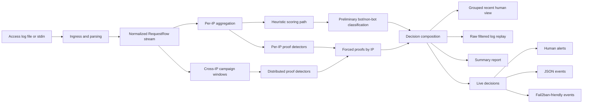

The key architectural point is that LGU has two parallel reasoning lanes:

- a cheap heuristic lane based on per-IP rolling counters
- a stronger proof lane based on explicit suspicious patterns

The final decision is the union of those two lanes, not either one alone.

## Detector Correctness Lab

Detector behavior is treated as a versioned contract, not as ad hoc test data.
The test-side lab has five layers:

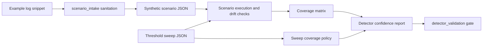

- `tests/scenario_intake.py` sanitizes examples, probes current detector output,
  and emits synthetic scenario drafts with expectation stubs.
- `tests/scenario_dsl.py` validates scenario schema, executes batch/live
  expectations, and fails on unexpected proof or reason drift.
- `tests/scenario_matrix.py` checks positive, negative, and live coverage for
  every cataloged detector kind.
- `tests/scenario_sweeps.py` expands threshold boundary variants and validates
  `covers` metadata against `tests/sweeps/coverage_policy.json`.
- `tests/detector_report.py` produces the operator-readable and JSON work queue
  for missing coverage, sweep errors, hygiene failures, and threshold expansion.
- `tests/detector_validation.py` is the executable gate that composes the whole
  lab and is what CI runs through `scripts/run_detector_quality.sh`.

## Core Concepts

### 1. The Atomic Event: `RequestRow`

All meaningful system behavior starts from a normalized `RequestRow`.

A `RequestRow` contains:

- parsed timestamp
- IP
- method
- path
- status
- referer
- user agent

In batch mode it also contains raw file offsets so the original log line can be replayed exactly later.

This is the single canonical representation of “one request that survived initial parsing and path filtering.”

### 2. The Analytical Unit: IP-Scoped Behavior

LGU’s first major transformation is:

> `RequestRow` stream -> per-IP behavior state

The main unit of cheap aggregation is the IP. This is not because IP is trustworthy, but because many access-log abuse patterns are still easiest to observe as high-density request behavior emitted by one apparent origin.

This yields an `IPStats` object that answers questions like:

- how many requests came from this IP
- how many distinct paths did it touch
- how bursty was it in short windows
- how many HEADs did it issue
- how strong was the “paced sweep” pattern
- how long was its fast sequential streak
- did its UA or referer trip known-bot signatures

### 3. The Stronger Unit: Proofs

Some suspicious behaviors are not well represented by cheap counters alone.

Examples:

- “same IP swapped UAs within the same second on a mutated twin request”
- “same raw UA is distributed across many IPs sweeping many paths”
- “many IPs are fuzzing the same parameter family in a tight time window”

Those become `ForcedProof`s.

This is the architectural boundary between:

- probabilistic suspicion
- explicit strong evidence

### 4. The Final Decision Unit: Effective Bot IP Set

The actual final classification is:

```text
effective_bot_ips =
    ips flagged by cheap per-IP heuristics
    union
    ips with strong proof-based findings
```

This matters because an IP can look “clean” on simple totals but still be forced suspicious by:

- distributed campaign membership
- exact mutation/fuzzer behavior
- UA switching behavior

## Data Ingress Architecture

There are two ingress modes.

### Batch ingress

`log-audit` accepts:

- a file path
- or `stdin`

If data arrives through `stdin`, LGU spools it to a temporary file first.

That is not an implementation accident. It exists because batch mode needs a two-phase workflow:

1. analyze rows
2. potentially replay original raw lines later

That replay is used by `--raw-filtered-lines`, the raw access-log replay mode.

### Live ingress

`log-watch` accepts:

- a one-shot file read
- a follow mode on a file
- or `stdin`

In live mode, rows are not replayed from file offsets. The live pipeline is transition-based rather than replay-based.

## Parsing and Early Reduction

The first architectural filter is “what is even worth turning into a row?”

### Parsing stages

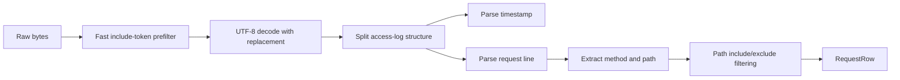

### Why the early path filter exists

LGU is often used on a subset of site traffic, not the entire site.

Examples:

- only posts
- only articles
- only a certain path family

So the architecture makes an explicit distinction between:

- lines parsed from the file
- lines that match the operator’s analytical scope

This is why the system reports both:

- `parsed_lines`
- `matched_lines`

### Fast token prefilter

When the operator supplies include patterns, LGU extracts literal-like byte tokens from those patterns and performs a cheap raw-byte test before UTF-8 decode and full parse.

This is not semantically authoritative. It is a fast rejection layer to reduce expensive parsing work.

## Batch Aggregation Architecture

Once rows exist, batch mode performs one major collection pass.

### High-level batch dataflow

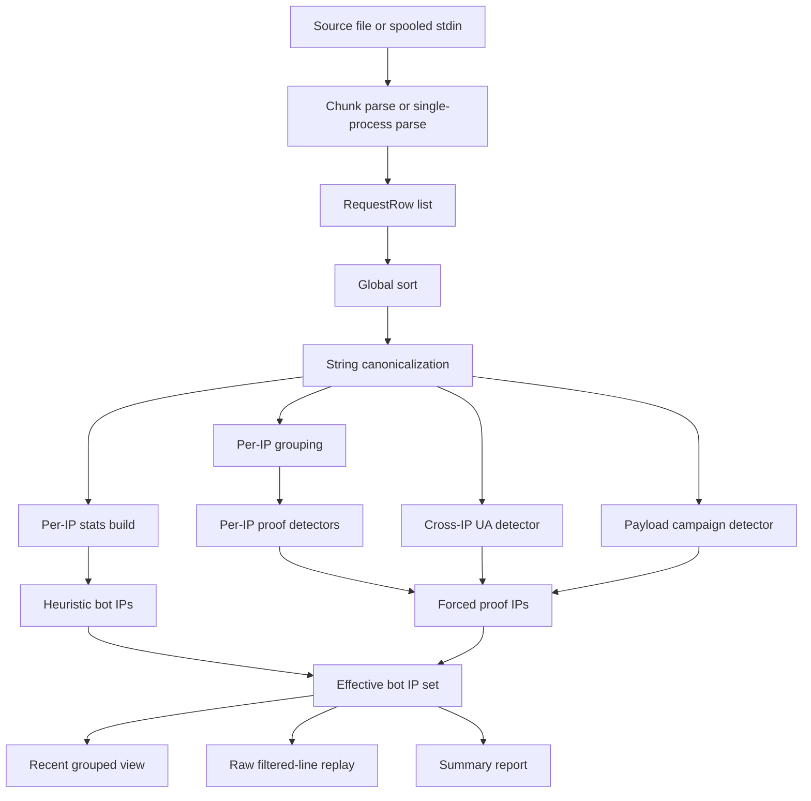

`Effective bot IP set` includes heuristic bots, proof-driven bots, and operator-selected provider exclusions. Output mode selection happens after that classification step:

| Output mode             | Selector                           | Formatter                          |
| ----------------------- | ---------------------------------- | ---------------------------------- |
| grouped survivor view   | no output-mode flag                | compact `(ip, ua)` grouped history |
| grouped classified view | `--bots-only`                      | compact `(ip, ua)` grouped history |
| summary report          | `--summary`                        | aggregate suspect and clean tables |
| classified-only summary | `--summary --bots-only`            | aggregate classified-IP tables     |
| raw survivor replay     | `--raw-filtered-lines`             | original access-log bytes          |
| raw classified replay   | `--raw-filtered-lines --bots-only` | original access-log bytes          |

Provider range loading and `--exclude-provider-traffic` feed classification. They do not decide whether the output is grouped, summarized, or raw replay.

### Why there is a global sort

Many later detectors rely on meaningful temporal order:

- serial sweeps
- same-page mutation pairs
- UA switch windows
- coordinated multi-IP windows

Merged or multi-process logs are not guaranteed to already be in-order, so the architecture normalizes into a global time-ordered row stream before deep analysis.

### Why canonicalization exists

After the global sort, LGU interns repeated strings across rows:

- IP
- path
- UA
- referer
- status
- method
- raw timestamp

This shrinks memory churn for later detector passes that repeatedly compare or count identical strings.

## Per-IP Heuristic Path

The cheapest analytical path is “keep rolling counters per IP while scanning rows.”

### Heuristic dataflow

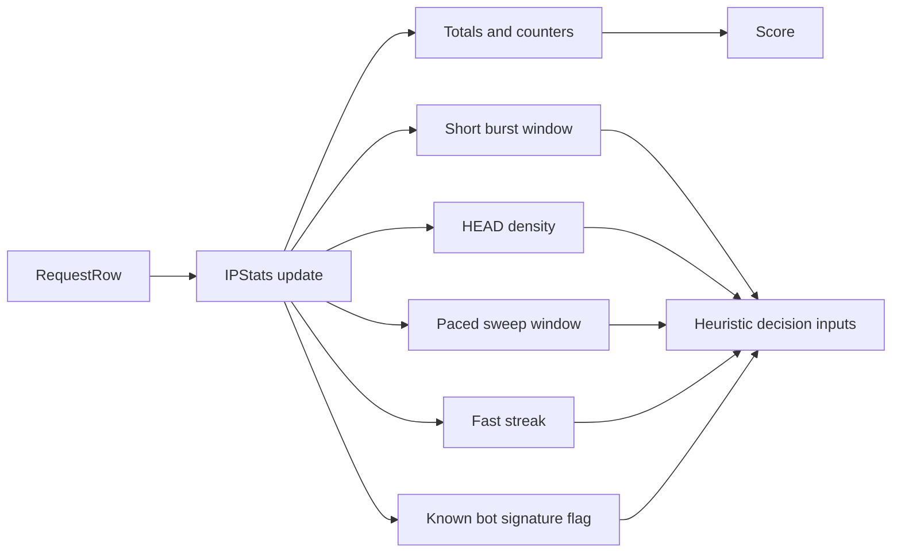

### What `IPStats` is really doing

`IPStats` is a summary of one IP’s observable local behavior in this dataset.

It combines:

- simple counts
- sliding windows
- maxima over those windows

The critical design detail is that `IPStats` is not storing all rows. It is storing enough rolling state to cheaply answer “does this IP look obviously machine-like in the common ways?”

### Heuristic decision families

This path can independently push an IP toward bot classification through:

- known-bot signature match
- burst density
- HEAD storms
- paced sweep with dominant referer behavior
- long fast-streak path walking

These are cheap and broad detectors. They are meant to catch easy cases early.

## Proof Generation Architecture

The second lane is proof generation.

This lane exists because many modern crawlers are deliberately tuned to avoid obvious cheap heuristics.

### Proof architecture

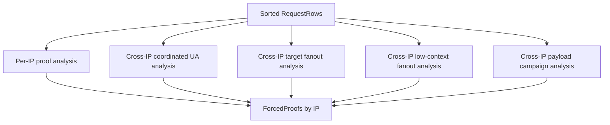

The core idea here is:

> if a behavior is qualitatively suspicious enough, LGU should not rely on aggregate score alone

## Per-IP Proof Pipeline

### Flow

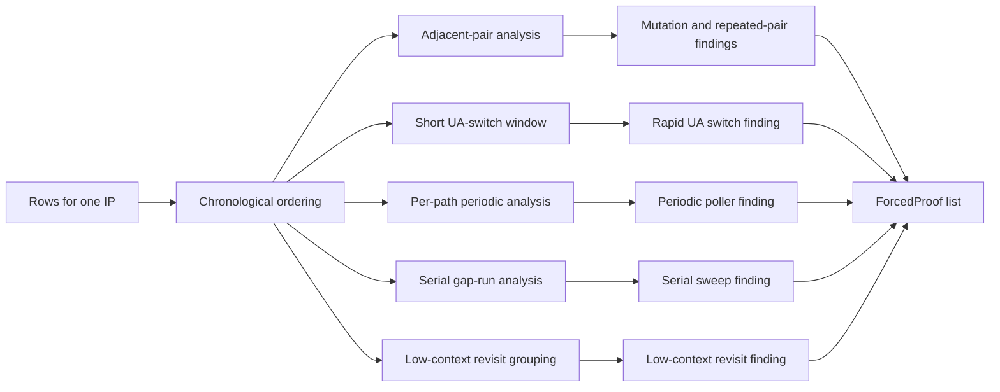

### Why adjacent pairs matter

A surprising amount of bot behavior becomes visible when looking at consecutive row pairs for one IP:

- same base path, different query
- same-page mutation attempts
- synthetic repeated page-pair sessions
- same-second twin requests with different UAs

This is a richer signal than simple per-window totals.

### Why UA-switch detection uses a rolling window

The system is not trying to detect all multi-UA behavior forever. It is trying to detect fast identity instability.

That is why the detector looks at:

- multiple distinct UAs
- multiple UA families
- in a very small time window

This is architecturally different from “rotating-ua,” which looks at larger per-IP identity churn across the whole slice.

### Why low-context revisits are separate

Some repeat fetchers never build enough path diversity to trip redundant-revisit or serial-sweep rules. LGU treats repeated same-target fetches with only direct/root referer context as a separate proof because the absence of surrounding navigation context is the signal.

### Why payload mutation is treated specially

Payload-marker mutations are important because they turn otherwise ambiguous traffic into a stronger form of “bot actively probing or fuzzing behavior.”

The system explicitly upgrades suspicion when it sees:

- same-page mutations
- malformed query variants
- referer junk
- same-second UA switching on mutation twins

## Distributed Detector Architecture

Single-IP heuristics are not enough for modern abuse. LGU therefore has a separate distributed reasoning layer.

### Coordinated UA detector

This detector asks:

> does one raw UA appear across enough IPs, enough paths, and a tight enough time window to imply a coordinated sweep rather than coincidental traffic?

Flow:

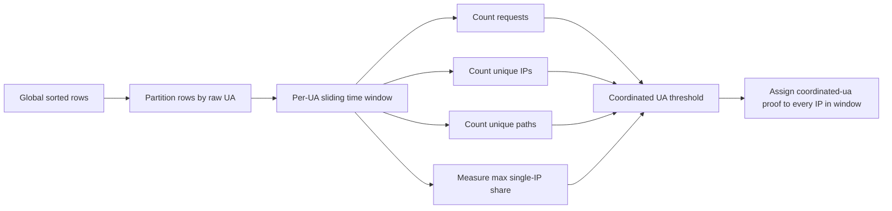

Why the “max IP share” check exists:

- to prevent one noisy IP plus a couple of incidental requests from looking like a distributed swarm

### Coordinated target fanout detector

This detector asks:

> are many IPs converging on the same content target with the same coarse browser family or exact UA?

It catches focused same-target swarms that may not have enough path diversity to look like a coordinated-UA sweep.

### Low-context fanout detector

This detector asks:

> are many shallow IPs fetching the same content target with only direct or root-page referer context?

Flow:

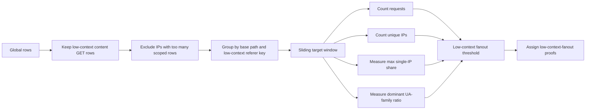

This layer is aimed at distributed scraper networks where each IP looks too quiet to classify alone, but the aggregate target/referrer shape is not how real readership usually appears.

### Payload campaign detector

This detector asks:

> are many IPs collectively expressing the same parameter-abuse or fuzzing family against structurally similar targets?

Flow:

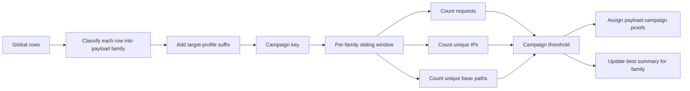

Architecturally, this is one of the most important layers in the system because it converts isolated suspicious requests into campaign-level meaning.

It is also intentionally one pass that produces both:

- forced proofs
- summary records

That avoids analysis drift between classification and reporting.

## Classification Composition

This is the part that matters most architecturally.

LGU does not have one single detector that declares truth. It composes decisions from multiple evidence layers.

### Composition flow

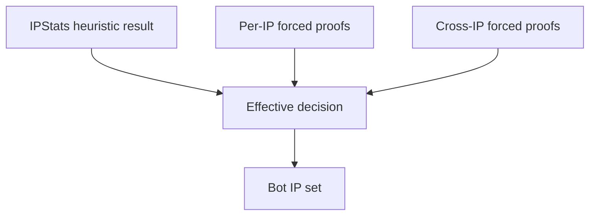

Formally:

```text
effective_bot(ip) =
    heuristic_bot(ip)
    OR
    has_forced_proof(ip)
```

This architecture deliberately prefers false positives to remain reviewable rather than invisible.

That is why:

- proof details are preserved
- reasons are rendered
- grouped suspicious views exist
- summary mode includes proof text

The system is not meant to be a black box.

## Output Architecture

Once the effective bot set exists, the same internal decision graph can drive different output surfaces.

### Output modes in batch

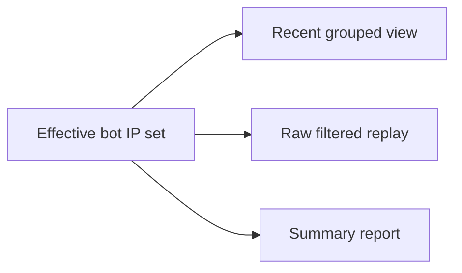

### Grouped recent view

Purpose:

- answer “what are the plausible humans reading right now?”

Transformation:

1. take the most recent matching rows after effective classification
2. sort them by time
3. group by `(ip, ua)`
4. assign display sequence numbers
5. print compact fetch history per group

Architectural meaning:

- this mode is not just raw output
- it is a session-ish reconstruction optimized for operator reading

### Raw filtered replay

Purpose:

- preserve exact original log text for downstream shell pipelines
- implement `--raw-filtered-lines`; the default output remains the grouped recent view

Transformation:

1. iterate matched `RequestRow`s
2. consult effective bot membership
3. seek back into the source file using stored offsets
4. replay the original bytes

Architectural meaning:

- batch analysis is logically separate from output reproduction
- the system keeps enough provenance to replay exact input text
- raw replay is an output shape, not a detector toggle

### Summary report

Purpose:

- show top suspicious IPs, strong proof text, and major distributed campaigns

Transformation:

1. rank suspect IPs by score
2. merge heuristic reasons and proof kinds
3. attach proof details
4. optionally include campaign summaries
5. optionally include heavy clean-IP hitters for operator review

Architectural meaning:

- this is the explanatory surface for tuning and auditing the detector itself

## Live Architecture

`log-watch` reuses the same detector core, but the controlling architecture is different.

In batch mode, the question is:

> after analyzing the whole bounded slice, what should we show?

In live mode, the question is:

> after this new row arrives, did the system transition to a state that is worth emitting?

### High-level live flow

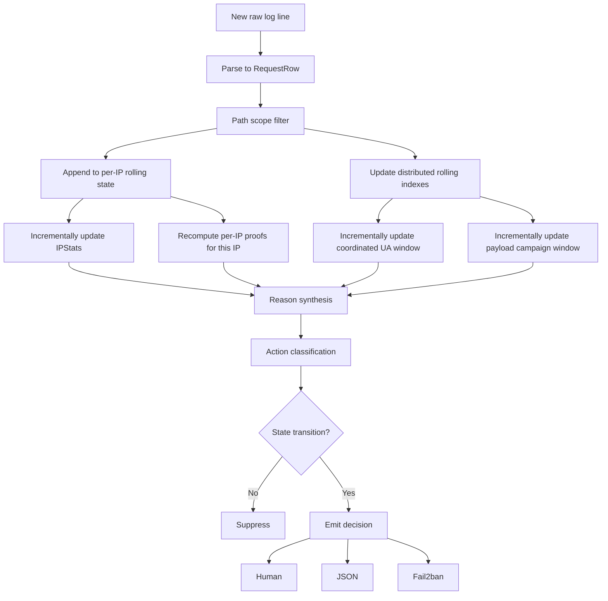

### Rolling live state

Live mode maintains two rolling state families:

- per-IP retained rows
- distributed keyed windows for:
  - raw UA
  - payload campaign family

These windows have different purposes:

- per-IP state supports single-origin behavior analysis
- distributed keyed windows support coordinated swarm and campaign detection

### Why live mode still mixes incremental and recompute-based analysis

Current live architecture is now incremental where that pays off most:

On each new row it:

- incrementally updates `IPStats` for that IP unless local expiration forces a rebuild
- reruns per-IP proof analysis for that IP
- incrementally updates the coordinated-UA state for the current raw UA
- incrementally updates the payload-campaign state for the current campaign family

This is still computationally heavier than a fully detached streaming proof engine, but it keeps important architectural benefits:

- shared detector semantics between batch and live
- exact proof explainability for the active IP
- proof generation stays explainable
- no whole-global-window rescans for distributed detectors on every event

## Live Decision Model

The live decision architecture adds one more layer on top of effective classification: transition control.

### Action classes

- `clean`
- `suspect`
- `ban`

### Action derivation

`classify_action()` combines:

- score
- reason list
- strong proof kinds

Strong proof kinds directly force `ban`.

Otherwise:

- score above `ban_score` => `ban`
- any reasons or score above `suspect_score` => `suspect`
- else => `clean`

### Transition gating

Even if a row is suspicious, LGU may suppress output if:

- the action is still `clean`
- the action is `suspect` and `--emit-suspects` is off
- the same action was already emitted within cooldown
- the new action is a downgrade from the last emitted action

This is a critical architectural choice:

> live mode is not an event-per-request stream; it is a state-transition stream

That makes it suitable for:

- operator attention
- machine pipelines
- fail2ban ingestion

without turning into noise.

## Live Output and Automation Path

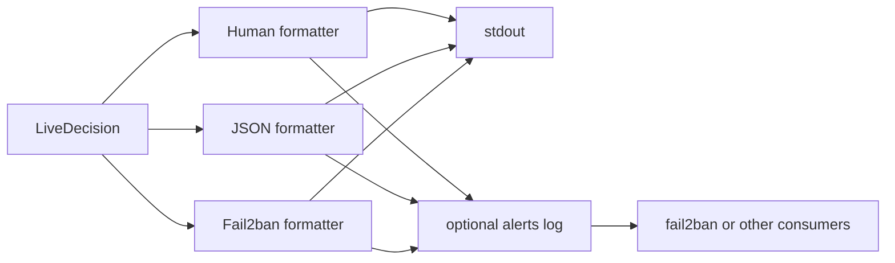

### Why fail2ban is treated as a sink, not a core subsystem

LGU’s job is:

- detect
- explain
- emit

Fail2ban’s job is:

- ban
- unban
- escalate
- manage recidivism

That separation keeps LGU focused on behavioral interpretation instead of firewall lifecycle management.

## Config Architecture

The config model is intentionally narrow and layered.

### Layers

1. packaged generic defaults
2. zero or more user-supplied JSON config files
3. CLI-supplied ad hoc bot patterns

### Why payload markers are config-driven

Parameter abuse is often site-specific.

The architecture therefore separates:

- generic behavioral reasoning about payload-like parameters
- site-specific definitions of which parameters matter

That is why `payload_marker_patterns` are data, not code.

### Why known-bot patterns are still config

Known-bot signatures are useful but never sufficient.

They live in config so they can evolve without turning the core analyzer into a hardcoded pile of operator-specific rules.

## Caching and Memory Architecture

LGU uses caches in two different ways.

### Semantic caches

These avoid repeating expensive derived classification on identical strings:

- payload marker checks
- payload family classification
- payload campaign key generation
- UA summary reduction
- referer junk detection
- base path extraction

### Parse-time local caches

These reduce cost while scanning:

- timestamp day cache
- known-bot `(ua, referer)` cache

### Canonicalization

This is not the same as memoization. Canonicalization reduces duplicate string objects after parsing, which lowers memory churn during later aggregation and proof passes.

## Architecture of Evidence

The most important design idea in LGU is that evidence becomes progressively more semantic as it moves through the system.

### Level 1: Raw facts

Examples:

- one GET to one path
- one user agent
- one referer
- one timestamp

### Level 2: Local aggregates

Examples:

- 12 requests in 2 seconds
- 9 unique paths in a sweep window
- 6 HEADs in a burst window

### Level 3: Behavioral interpretations

Examples:

- fast streak
- paced sweep
- periodic poller
- rotating UA

### Level 4: Strong proofs

Examples:

- same-second UA swap
- repeated pair
- payload fuzzer
- coordinated UA
- payload campaign

### Level 5: Actions

Examples:

- suppress from recent human view
- include in suspicious view
- emit summary proof
- raise live `suspect`
- raise live `ban`

Architecturally, LGU is not one detector. It is a ladder from raw fact to action.

## Design Strengths

The source shows several strong architectural qualities.

### Shared detector core

Batch and live use the same analytical primitives. That reduces conceptual drift.

### Two-lane decision model

Cheap heuristics and stronger proof detectors complement each other well.

### Output decoupling

The same internal decision graph can feed:

- readable grouped operator output
- exact raw log replay
- summary reports
- JSON events
- fail2ban lines

### Generic public-release model

Site-specific detector data is separated into config instead of being hardcoded into the detector logic.

## Current Architectural Weaknesses

The architecture also reveals some clear limits.

### Per-IP proofs are still recompute-based

The live engine now maintains incremental per-IP stats and incremental distributed windows, but the proof pass for the current IP still replays that IP’s retained rows.

This keeps proof semantics aligned and explainable, but it remains the main live hot path for very busy IPs.

### Effective bot decision is IP-scoped

The final action unit is still the IP. That is practical for logs and fail2ban, but it means more complex identity models such as:

- IP + UA fingerprint
- IP + referer behavior
- provider or ASN clustering
- optional provider range attribution through pluggable local source adapters

are not first-class action objects yet.

### Config model is intentionally small

Right now the config is good for:

- known bot regexes
- payload marker regexes

It is not yet a richer typed policy model with:

- CIDRs
- allowlists
- deny prefixes
- weighted signatures
- action policies

## End-to-End Example: Batch

This is the architecture in action for a typical recent-traffic audit.

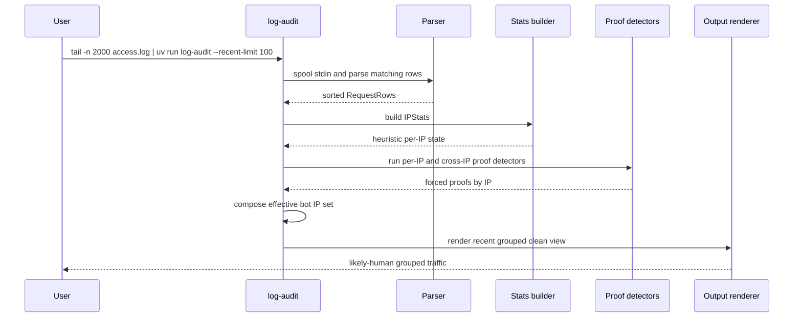

## End-to-End Example: Live

This is the architecture in action for a streaming alert pipeline.

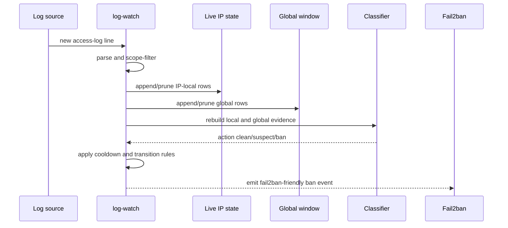

## The Real Architectural Summary

LGU is best understood as a behavioral evidence engine over access logs.

Its structure is:

- normalize requests into a common row model
- reduce those rows into cheap local aggregates
- derive stronger explicit proofs from ordered local and distributed patterns
- compose heuristics and proofs into effective decisions
- render those decisions differently for batch introspection and live automation

The architecture is therefore not “a parser plus some regexes.”

It is:

- a bounded batch analysis engine
- a rolling live decision engine
- both driven by the same layered evidence model

That layered evidence model is the core of the system.

## Threat Model

LGU is not trying to solve “identify every automated system on the internet.” It is trying to solve a narrower and more operationally useful problem:

> detect access-log behaviors that are inconsistent with plausible human reading or normal well-behaved machine consumption

### Protected asset

The protected asset is not only server capacity. It is also:

- operator attention
- trustworthy traffic introspection
- site-specific access policy enforcement
- the ability to distinguish humans from abusive crawling in real time

### In-scope adversary classes

#### Honest declared bots

Examples:

- feed readers
- simple crawlers
- bots that still self-identify in UA or referer

These are mostly handled by known-bot pattern matching. They are the easy class.

#### Disguised single-IP crawlers

Examples:

- broad archive walkers using browser-like UAs
- paced fetchers that avoid extreme bursts
- bots with blank or trivially repeated referers

These are handled primarily by:

- burst detection
- fast streak detection
- paced sweep detection
- serial sweep detection

#### Identity-manipulating single-IP actors

Examples:

- same-IP fast UA switching
- rotating UA farms through one origin
- same-second twin requests with different UAs

These are handled primarily by:

- `rapid-ua-switch`
- `rotating-ua`
- `same-second-ua-swap`

#### Distributed coordinated crawlers

Examples:

- many IPs sharing one UA and sweeping path ranges
- distributed campaigns with low per-IP density but obvious collective timing

These are handled primarily by:

- `coordinated-ua`
- `payload-campaign`

#### Fuzzers and active probes

Examples:

- parameter mutation
- malformed referers
- injection-style probes
- payload-marker walkers
- browser-like dependency loading followed by exposed-file probing

These are handled primarily by:

- payload marker classification
- `asset-primed-probe`
- `payload-fuzzer`
- `payload-campaign`
- injection and referer-junk logic

### Important non-goals

LGU is not currently designed to provide:

- cryptographic identity or user attribution
- browser fingerprinting beyond coarse UA-derived families
- ASN-aware or provider-aware policy decisions
- perfect disambiguation between privacy-preserving users and sophisticated crawlers
- a full WAF or firewall engine

### What counts as “suspicious” in this architecture

Suspicion is produced when one or more of these become true:

- too much happens too quickly for one apparent reader
- traversal looks structurally systematic rather than selective
- the same origin mutates parameters or referers in bot-like ways
- identity changes too fast to be human-plausible
- multiple origins form a collective pattern that is stronger than any one origin alone

### Threat-model boundary

The system is strongest when the adversary leaks one of:

- timing regularity
- traversal regularity
- identity instability
- mutation behavior
- distributed coordination

It is weakest against:

- very low-rate distributed crawlers that stay below all local and collective thresholds
- real humans using privacy tools whose browsing behavior happens to mimic automation
- abuse that is only visible with data not present in access logs

## Detector Taxonomy

The detector architecture is easiest to understand when grouped by scope and signal family.

| Detector / mechanism          | Scope           | Signal family          | Primary inputs                                           | Output type                     | Main purpose                                         |
| ----------------------------- | --------------- | ---------------------- | -------------------------------------------------------- | ------------------------------- | ---------------------------------------------------- |
| Known bot pattern match       | Per-IP          | Signature              | UA, referer                                              | Heuristic flag                  | Catch declared or trivially identified bots          |
| Burst detector                | Per-IP          | Rate                   | Request timestamps, path diversity                       | Heuristic flag                  | Catch short dense fetch storms                       |
| HEAD burst detector           | Per-IP          | Rate                   | Method mix, burst window                                 | Heuristic flag                  | Catch HEAD-heavy scanners                            |
| Paced sweep detector          | Per-IP          | Sequence + rate        | Longer window, path diversity, dominant referer ratio    | Heuristic flag                  | Catch archive walkers that are slower than bursts    |
| Fast streak detector          | Per-IP          | Sequence               | Inter-request gaps, path changes                         | Heuristic flag                  | Catch dense path-walking streaks                     |
| Repeated pair                 | Per-IP          | Sequence               | Adjacent request pairs                                   | Forced proof                    | Catch repeated synthetic two-step sessions           |
| Tight multi-fetch             | Per-IP          | Timing + repetition    | Short content window, repeated paths, same-second fanout | Forced proof                    | Catch compact synthetic multi-page fetch groups      |
| Asset-primed probe            | Per-IP          | Probe after render     | Page request, dependencies, exposed-file probes          | Forced proof                    | Catch browser-like scanners that pivot after loading |
| Rotating UA                   | Per-IP          | Identity               | Distinct UAs and UA families                             | Forced proof                    | Catch one origin cycling through browser identities  |
| Cadenced repeat               | Per-IP          | Temporal regularity    | Same-path long gaps, stable interval, dominant referer   | Forced proof                    | Catch low-rate scheduled content re-fetching         |
| Periodic poller               | Per-IP          | Temporal regularity    | Same-path gaps and methods                               | Forced proof                    | Catch periodic machine polling                       |
| Serial sweep                  | Per-IP          | Sequence + timing      | Ordered path walk with bounded gaps                      | Forced proof                    | Catch machine-like sequential archive traversal      |
| Payload fuzzer                | Per-IP          | Mutation               | Payload markers, referer junk, injection strings         | Forced proof                    | Catch active parameter and referer probing           |
| Same-second UA swap           | Per-IP          | Mutation + identity    | Same-base-path twin mutations, same-second UA switch     | Forced proof                    | Catch aggressive identity manipulation               |
| Rapid UA switch               | Per-IP          | Identity + timing      | Small time window, distinct UAs, distinct UA families    | Forced proof                    | Catch implausibly fast UA switching                  |
| Coordinated UA                | Cross-IP        | Campaign               | Same raw UA across IPs and paths in one window           | Forced proof                    | Catch distributed sweeps hiding behind IP spread     |
| Payload campaign              | Cross-IP        | Campaign + mutation    | Shared payload family, IP diversity, path diversity      | Forced proof + campaign summary | Catch distributed fuzzing and payload-abuse families |
| Target profile bucketing      | Per-row derived | Classification support | Path structure                                           | Campaign key component          | Normalize path families across arbitrary sites       |
| Payload family classification | Per-row derived | Classification support | Path, referer, payload markers                           | Campaign key component          | Convert individual rows into campaign semantics      |

### Taxonomy observations

The detector set is intentionally layered:

- heuristic detectors are cheap and broad
- proof detectors are narrower but stronger
- distributed detectors are the architecture’s answer to low-per-IP stealth

This means LGU is not relying on one magic signal. It is intentionally combining:

- signature
- rate
- sequence
- mutation
- distributed coordination

## Architecture-To-Detector Reference Map

This section connects each major architectural stage to the exact detector reference entries in [DETECTORS.md](./DETECTORS.md).

### 1. Parse and normalization stage

Primary purpose:

- convert raw access-log lines into normalized `RequestRow` records
- derive reusable row-level features that later detectors consume

Main derived features:

- base path
- target profile
- payload marker membership
- payload-marker mutation state
- referer junk classification
- injection payload classification
- UA summary and UA family

Reference entries:

- [Supporting Classifiers](./DETECTORS.md#supporting-classifiers)
- [Payload Marker](./DETECTORS.md#payload-marker)
- [Payload Marker Mutation](./DETECTORS.md#payload-marker-mutation)
- [Referer Junk](./DETECTORS.md#referer-junk)
- [Injection Payload](./DETECTORS.md#injection-payload)
- [Target Profile](./DETECTORS.md#target-profile)
- [Payload Family](./DETECTORS.md#payload-family)

### 2. Per-IP heuristic aggregation stage

Primary purpose:

- maintain cheap local behavior state for one apparent origin
- answer whether the IP already looks machine-like without needing stronger proof logic

Detectors in this stage:

- [Known Bot Pattern Match](./DETECTORS.md#known-bot-pattern-match)
- [Burst](./DETECTORS.md#burst)
- [HEAD Burst](./DETECTORS.md#head-burst)
- [Paced Sweep](./DETECTORS.md#paced-sweep)
- [Fast Streak](./DETECTORS.md#fast-streak)

Combined logic:

- these update `IPStats`
- `IPStats.is_bot()` applies conjunctions across their counters and maxima
- `IPStats.score()` also provides a ranking/suspicion surface even when the hard bot condition is not met yet

### 3. Per-IP proof stage

Primary purpose:

- catch qualitatively strong bot behavior that simple counters do not represent well

Detectors in this stage:

- [Repeated Pair](./DETECTORS.md#repeated-pair)
- [Asset-Primed Probe](./DETECTORS.md#asset-primed-probe)
- [Rotating UA](./DETECTORS.md#rotating-ua)
- [Periodic Poller](./DETECTORS.md#periodic-poller)
- [Serial Sweep](./DETECTORS.md#serial-sweep)
- [Payload Fuzzer](./DETECTORS.md#payload-fuzzer)
- [Same-Second UA Swap](./DETECTORS.md#same-second-ua-swap)
- [Rapid UA Switch](./DETECTORS.md#rapid-ua-switch)

Combined logic:

- all emitted findings become `ForcedProof`s
- these are unioned by IP
- in live mode, several of these proof kinds directly force `ban`

### 4. Cross-IP distributed stage

Primary purpose:

- detect coordination that is only obvious when many origins are viewed together

Detectors in this stage:

- [Coordinated UA](./DETECTORS.md#coordinated-ua)
- [Payload Campaign](./DETECTORS.md#payload-campaign)

Combined logic:

- these do not merely produce summaries
- they also assign `ForcedProof`s back to each participating IP
- this is how LGU catches low-per-IP stealth that would otherwise survive local scoring

### 5. Decision composition stage

Primary purpose:

- combine heuristic bot decisions and forced proofs into one effective classification surface

Reference entries:

- [How Detector Signals Combine](./DETECTORS.md#how-detector-signals-combine)
- [Decision Semantics](./DETECTORS.md#decision-semantics)
- [Strong Proof Kinds in Live Mode](./DETECTORS.md#strong-proof-kinds-in-live-mode)

Combined logic:

- batch:
  - `effective_bot(ip) = heuristic_bot(ip) OR has_forced_proof(ip)`
- live:
  - heuristic score and reasons are combined with proofs into `clean`, `suspect`, or `ban`

### 6. Output and operator surface stage

Primary purpose:

- turn the same internal decision graph into multiple output forms without changing classification meaning

Reference entries:

- [Decision Semantics](./DETECTORS.md#decision-semantics)

Output consumers:

- grouped recent human view
- raw filtered replay
- batch summary reports
- JSON live events
- fail2ban-friendly live events

### How to Read The Two Docs Together

Use [ARCHITECTURE.md](./ARCHITECTURE.md) when you want:

- end-to-end flow
- data transformations
- why stages exist
- how decisions move through the system

Use [DETECTORS.md](./DETECTORS.md) when you want:

- exact detector conditions
- thresholds and conjunctions
- which fields and dimensions each detector uses
- which proofs are considered strong enough to force live `ban`
- sequence
- mutation
- coordination

## Future Incremental Live Engine Redesign

The current live engine is correct and operational, but architecturally it still reuses batch-shaped analysis too directly.

Today, on each accepted row, live mode effectively does:

1. append row to per-IP retained state
2. append row to global retained state
3. rebuild per-IP aggregate state from retained IP rows
4. rerun per-IP proof detectors from retained IP rows
5. rerun coordinated cross-IP detection from retained global rows
6. rerun payload campaign detection from retained global rows
7. compose a new action and emit only if state transitioned

That is easy to reason about, but it is more computationally batch-like than a mature streaming engine should be.

### Redesign goal

Preserve the current decision semantics while moving live mode toward:

- incremental updates
- bounded retained state
- detector-specific rolling indexes
- stable performance under sustained event flow

### Target live architecture

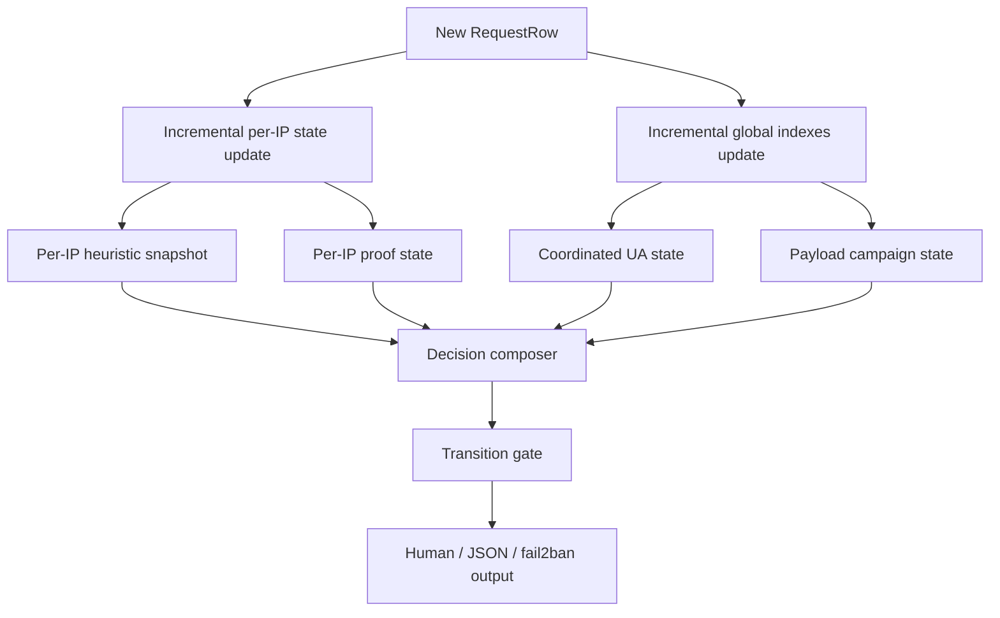

### Proposed state objects

#### `LiveIPAggregate`

Purpose:

- replace repeated `build_ip_stats(list(state.rows), args)` in the hot path

Would maintain incrementally:

- total request count
- method/status counters
- total distinct paths
- burst window deque and counts
- sweep window deque and counts
- fast streak state
- known-bot signature state

#### `LiveIPProofState`

Purpose:

- support per-IP proof detection without recomputing over all retained rows each time

Would maintain:

- adjacent transition memory for repeated pairs and mutation twins
- rolling UA-switch window
- per-path periodic poll sketches
- serial sweep run state
- rotating-UA counters

#### `LiveCoordinatedUAState`

Purpose:

- replace full rescans for coordinated same-UA campaigns

Would maintain, per raw UA:

- rolling deque of events
- current IP counts
- current path counts
- latest threshold satisfaction state

#### `LivePayloadCampaignState`

Purpose:

- replace full rescans for payload campaign analysis

Would maintain, per campaign key:

- rolling deque of candidate events
- IP counts
- base-path counts
- best active or recent window summary

### Proposed decision flow after redesign

The redesigned hot path should be:

1. parse one row
2. scope-filter by path
3. update incremental local and global state
4. derive the current IP’s heuristic snapshot
5. ask the relevant proof states whether they now implicate that IP
6. compose a decision
7. apply cooldown and monotonic transition rules
8. emit only if the action meaningfully changed

### What should stay shared with batch mode

The redesign should not fork the project into two unrelated detector stacks.

The following logic should remain shared:

- parsing and normalization to `RequestRow`
- payload family and target-profile classification
- UA summarization and family logic
- proof naming and semantics
- output format semantics

The live redesign should change orchestration and state maintenance, not the conceptual meaning of the detectors.

### Main risks in the redesign

#### Semantic drift

Incremental state can accidentally stop matching batch behavior.

Mitigation:

- create equivalence fixtures comparing:
  - current mixed incremental/recompute live decisions
  - redesigned incremental live decisions

#### State invalidation complexity

Incremental windows require careful expiration handling.

Mitigation:

- make append and prune explicit first-class operations
- keep state transitions testable in isolation

#### Explainability loss

A heavily optimized live engine can become harder to explain.

Mitigation:

- preserve proof details and sample evidence generation
- avoid opaque approximate-only logic for primary proofs

### Success criteria for the redesign

The live redesign is successful when:

- per-row cost scales with new information, not repeated reconstruction
- long-running live processes remain bounded in memory and latency
- overload degrades detector fidelity gracefully instead of disabling core detectors
- emitted actions remain explainable in the same terms as the current architecture
